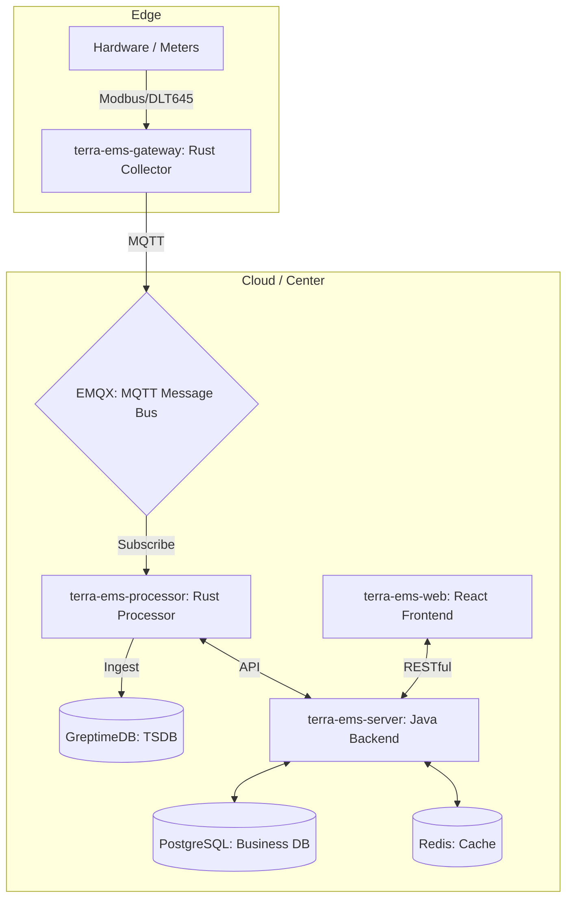

# Terra EMS Server — Backend Service

<h3 align="center">
   Terra Energy Management System — Enterprise-grade Energy Management & Carbon Analysis Platform
</h3>

<p align="center">
  
  
  
  
  
  
</p>

### 🏗️ System Architecture



<p align="center">
  <a href="./README.zh-CN.md">中文文档</a> | <span>English</span>
</p>

---

## 🖼️ System Screenshots

<p align="center">
  
  
</p>
<p align="center">
  
  
</p>

---

## 📋 Introduction

<p align="center">
  
</p>

Terra EMS (Terra Energy Management System) is a **modern energy management platform** designed for industrial enterprises. Built with Spring Boot 3.4 and Spring Data JPA, it provides comprehensive features including energy monitoring, TOU (Time-of-Use) electricity analysis, cost accounting, carbon emission measurement, energy benchmarking, and smart alerting.

> 📦 Frontend Repository: [terra-ems-web](https://github.com/dengxp/terra-ems-web)

## 🚀 Online Demo

*   **URL**: [http://terra-ems.com](http://terra-ems.com)
*   **Username**: `admin`
*   **Password**: `admin123`

> [!TIP]
> **Key Innovations**:
> 1. **High-Performance Edge Computing**: Rust-based gateway supporting thousand-level point collection, with disk-level Local Cache to ensure zero data loss during network flips.
> 2. **Minute-Level Deployment**: Support for YAML site configuration import, enabling one-click initialization of the entire site hierarchy (Site-Gateway-Meter-Point).

---

## ✨ Core Features

| Module | Description | Status |
|:---|:---|:---:|
| 🔋 **Base Data** | Energy types, Energy units (tree structure), Meters, Sampling points | ✅ |
| 🚀 **Fast Deploy** | **One-click YAML Site Import**, Auto-initialization | ✅ |
| 🛡️ **Edge Intel** | **Rust Collector**, Local Cache, Transparent Transmission | ✅ |
| 📊 **Statistics** | Consumption stats, YoY/MoM analysis, Trend analysis, Ranking, Dashboards | ✅ |
| ⚡ **Peak & Valley** | TOU pricing policy configuration, peak/valley/flat usage analysis | ✅ |
| 💰 **Cost Mgmt** | Price policy management, cost binding, cost records & variance analysis | ✅ |
| 🌍 **Carbon** | Carbon emission calculation, trend analysis, ranking | ✅ |
| 🎯 **Benchmarking** | Energy benchmarking (National/Industry/Enterprise/Regional standards) | ✅ |
| 🌱 **Energy Saving** | Lifecycle tracking of energy-saving projects, policy & regulation mgmt | ✅ |
| ⚠️ **Alerting** | Limit types, pre-alarm configuration, alert records & processing | ✅ |
| 📖 **Knowledge** | Energy-saving knowledge base (Markdown support) | ✅ |
| 🏭 **Production** | Product information, production record management | ✅ |
| 👤 **System Mgmt** | Users, Roles, Depts, Posts, Menus, Permissions, Dicts, Configs | ✅ |
| 📋 **Monitoring** | Login logs, Operation logs, Online users, Cache management | ✅ |

---

## 🛠️ Tech Stack

| Category | Technology | Version |
|:---|:---|:---|
| **Language** | Java 21 / **Rust 1.82+** | — |
| **Message Bus** | **EMQX (MQTT 5.0)** | 5.x |
| **Business DB** | PostgreSQL | 17 |
| **TSDB** | **GreptimeDB** | 0.9+ |
| **Cache** | Redis | 6+ |
| **Backend** | Spring Boot | 3.4.4 |
| **Frontend** | React + TypeScript + Ant Design Pro | — |

---

## 📁 Project Structure

```
terra-ems-server/
├── terra-ems-common/       # Common module: Result, ErrorCodes, Utilities
├── terra-ems-framework/    # Framework module: Security, JPA Base, Controller Hierarchy
├── terra-ems-system/       # Business module: Entity, Repository, Service (System + Business)
├── terra-ems-admin/        # Admin module: Bootloader, Controllers, API definitions
├── database/               # SQL scripts
└── Dockerfile              # Docker build file
### 3. All-in-One Start (Docker Compose)

If you have both `terra-ems-server` and `terra-ems-web` cloned in the same parent directory:

```bash
docker-compose up --build
```

This will spin up PostgreSQL, Redis, the Backend (8081), and the Frontend (80) automatically.

---

## 🚀 Quick Start

### 1. Database Initialization

```bash
# Using combined init script (includes schema + demo data)
psql -U postgres -d terra_ems -f database/combined_init_postgres.sql
```

### 2. Build & Run

```bash
mvn clean install -DskipTests
cd terra-ems-admin
mvn spring-boot:run
```

Access Swagger UI: `http://localhost:8081/api/swagger-ui.html`

---

## 🤝 Contribution & Feedback

We welcome bug reports, feature suggestions, or usage inquiries via [Issues](https://github.com/dengxp/terra-ems-server/issues).

> [!IMPORTANT]
> **About Pull Requests (PR)**:
> To maintain project architectural consistency and ensure the stability of future commercial roadmap, **we are not currently accepting external code contributions (Pull Requests)**. We appreciate your understanding and welcome discussions through Issues.

---

## 📜 License

[MIT License](LICENSE) — Copyright © 2025-2026 Terra Technology (Guangzhou) Co., Ltd.
