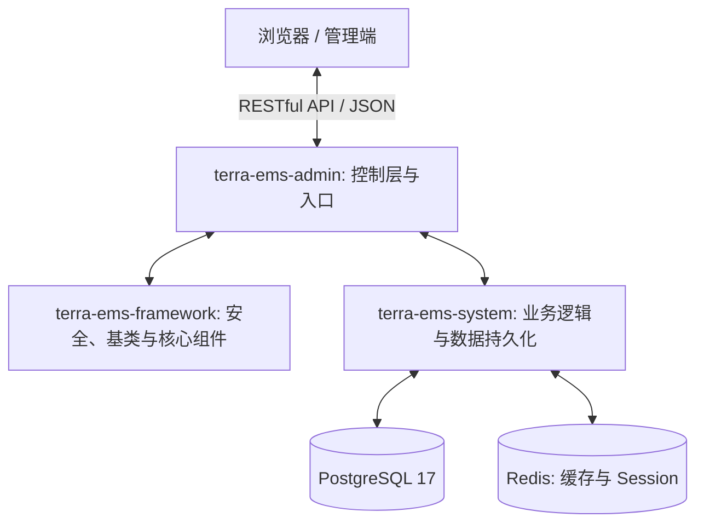

# Terra EMS Server — 后端服务

<p align="center">
  <strong>🌿 Terra 能源管理系统 — 企业级能源管理与碳排放分析平台</strong>
</p>

<p align="center">
  
  
  
  
  
  
</p>

### 🏗️ 逻辑架构图



---

## 🖼️ 系统截图展示

<p align="center">
  
  
</p>
<p align="center">
  
  
</p>

---

## 📋 项目简介

<p align="center">
  
</p>

Terra EMS（Terra Energy Management System）是一套面向工业企业的**现代化能源管理平台**，基于 Spring Boot 3.4 + Spring Data JPA 构建，提供能耗监测、分时电价分析、成本核算、碳排放计量、能效对标、告警预警等核心功能，帮助企业实现能源数字化管理与节能减排目标。

> 📦 前端仓库：[terra-ems-web](https://github.com/dengxp/terra-ems-web)

## 🚀 在线演示

*   **演示地址**：[在线演示](https://terra-ems.com)
*   **账号**：`admin`
*   **密码**：`admin123`

> [!TIP]
> **不仅是 EMS，更是一个完备的 Web 开发基座**：
> Terra EMS 的底层架构参考了业界主流标准，其**基础权限管理、字典、配置、日志及自动化的 CRUD Hook 体系**已非常成熟，成熟度不逊于 RuoYi (若依)。您完全可以将其作为通用的 Java Web 快速开发框架使用，基础模块开箱即用。

---

## ✨ 核心功能

| 模块 | 功能描述 | 状态 |
|:---|:---|:---:|
| 🔋 **基础数据** | 能源类型、用能单元（树形结构）、计量器具、采集点位 | ✅ |
| 📊 **统计分析** | 能耗统计、同比环比、趋势分析、排名分析、综合看板 | ✅ |
| ⚡ **峰谷分析** | 分时电价策略配置、尖峰平谷用电量分析 | ✅ |
| 💰 **成本管理** | 电价策略管理、成本策略绑定、能源成本记录与偏差分析 | ✅ |
| 🌍 **碳排放** | 碳排放核算、碳排放趋势、排名分析 | ✅ |
| 🎯 **对标管理** | 能效对标值管理（国标/行标/企标/区域标准） | ✅ |
| 🌱 **节能管理** | 节能项目全生命周期跟踪、政策法规管理 | ✅ |
| ⚠️ **告警管理** | 告警限值类型、预报警配置、告警记录处理 | ✅ |
| 📖 **知识库** | 节能知识文章管理（Markdown 支持） | ✅ |
| 🏭 **生产管理** | 产品信息管理、生产记录管理 | ✅ |
| 👤 **系统管理** | 用户、角色、部门、岗位、菜单、权限、字典、系统配置 | ✅ |
| 📋 **系统监控** | 登录日志、操作日志、在线用户、缓存管理 | ✅ |

---

## 🛠️ 技术栈

| 类别 | 技术 | 版本 |
|:---|:---|:---|
| **语言** | Java | 21 |
| **框架** | Spring Boot | 3.4.4 |
| **ORM** | Spring Data JPA + Hibernate | — |
| **数据库** | PostgreSQL | 17 |
| **缓存** | Redis + Spring Session | 6+ |
| **认证** | Header-Based Token (`X-Terra-Auth-Token`) | — |
| **工具库** | Lombok / MapStruct / Hutool / Guava | — |
| **构建** | Maven | 3.9+ |

---

## 📁 项目结构

```
terra-ems-server/
├── terra-ems-common/       # 通用模块：统一响应 Result、异常码、工具类
├── terra-ems-framework/    # 框架模块：Security 配置、JPA 基类、Controller 继承体系
├── terra-ems-system/       # 业务模块：Entity、Repository、Service（系统+业务）
├── terra-ems-admin/        # 管理模块：启动类、Controller 层、API 接口定义
├── database/               # 数据库脚本
└── Dockerfile              # Docker 构建文件
```

### Controller 继承体系

```
Controller                          # 基类，统一响应转换
    └── ReadableController          # 只读（查询、分页）
            └── WritableController  # 读写（增删改查）
                    └── BaseController  # 完整 CRUD
```

---

## 🚀 快速开始

### 1. 数据库初始化

```bash
# 使用完整初始化脚本（包含表结构 + 演示数据）
psql -U postgres -d terra_ems -f database/combined_init_postgres.sql
```

### 2. 构建与运行

```bash
mvn clean install -DskipTests
cd terra-ems-admin
mvn spring-boot:run
```

应用启动后访问：`http://localhost:8081/api/swagger-ui.html`

### 3. 一键启动 (Docker Compose)

如果您将 `terra-ems-server` 和 `terra-ems-web` 克隆在同一个父目录下，可以使用以下命令一键启动全套系统：

```bash
docker-compose up --build
```

该命令将自动启动 PostgreSQL、Redis、后端服务 (8081) 和前端服务 (80)。

---

## 🤝 贡献与反馈

我们非常欢迎通过 [Issues](https://github.com/dengxp/terra-ems-server/issues) 提交 Bug 报告、功能建议或使用咨询。

> [!IMPORTANT]
> **关于代码提交（PR）**：
> 为确保项目核心架构的一致性及后续商业化规划的稳定性，**目前本项目暂不接受外部代码提交（Pull Requests）**。感谢您的理解，我们欢迎大家以 Issue 的形式参与讨论。

---

## 📜 开源协议

[MIT License](LICENSE) — Copyright © 2025-2026 泰若科技（广州）有限公司
